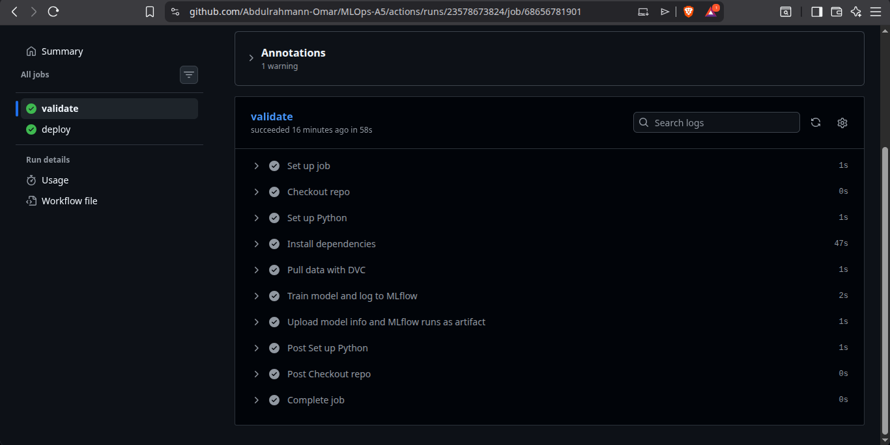
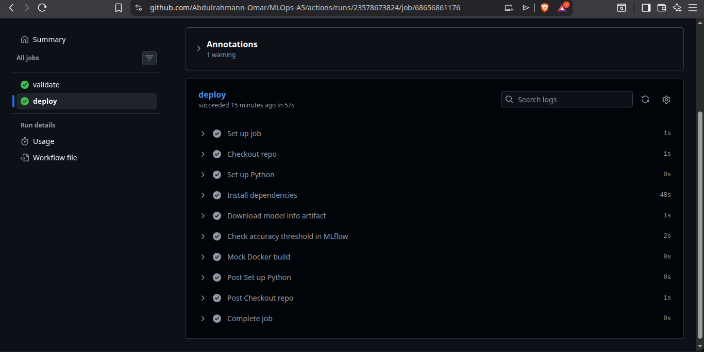
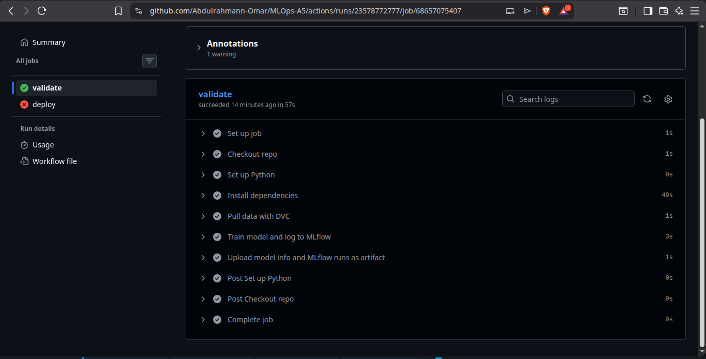
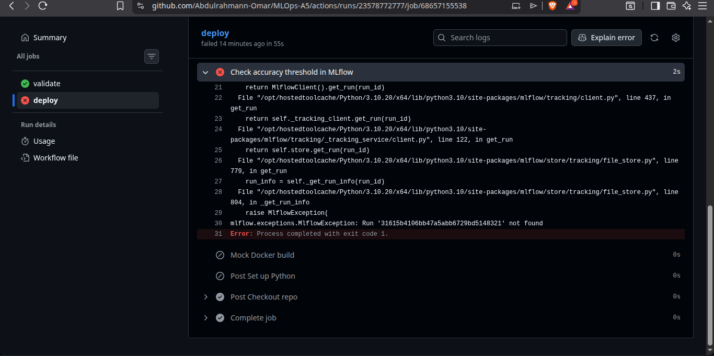

# MLOps Assignment 5 — CI/CD Pipeline with MLflow & Docker

**Name:** Abdulrahman Omar  
**Course:** MLOps — Zewail City  
**Repo:** [Abdulrahmann-Omar/MLOps-A5](https://github.com/Abdulrahmann-Omar/MLOps-A5)

---

## Overview

This assignment builds a two-job GitHub Actions pipeline that:

1. **Validates** a model by training it and logging accuracy to MLflow
2. **Deploys** it (mock Docker build) only if accuracy ≥ 0.85

The key challenge is passing data (`model_info.txt` + `mlruns/`) between two separate GitHub runners using artifacts.

---

## Repository Structure

```
.
├── .github/workflows/pipeline.yml   # The CI/CD pipeline
├── train.py                         # Trains Iris classifier, logs to MLflow, writes Run ID
├── check_threshold.py               # Reads Run ID, checks accuracy >= 0.85 in MLflow
├── Dockerfile                       # Uses python:3.10-slim + ARG RUN_ID
├── requirements.txt
└── Screenshots/
    ├── the 2 runs.png
    ├── Run-1-successValidate.png
    ├── Run-1-successDeploy.png
    ├── Run-2-Validate.png
    └── run-2-Deploy.png
```

---

## How It Works

### Job 1: `validate`

- Installs dependencies and pulls data with `dvc pull`
- Runs `train.py` with an optional `--label-noise` flag to simulate low accuracy
- Logs the run to MLflow (falls back to `file:./mlruns` if no secret is set)
- Writes the **MLflow Run ID** to `model_info.txt`
- Uploads `model_info.txt` + `mlruns/` as a GitHub artifact → this is how data crosses to job 2

### Job 2: `deploy`

- Downloads the artifact from job 1
- Runs `check_threshold.py` — reads the Run ID, queries MLflow, fails (`sys.exit(1)`) if accuracy < 0.85
- If check passes: runs Mock Docker Build  
  `echo "Building Docker image for Run ID: $(cat model_info.txt)"`

### Dockerfile

```dockerfile
FROM python:3.10-slim
ARG RUN_ID
ENV RUN_ID=${RUN_ID}
...
RUN echo "Fetching model for run ${RUN_ID}"
```

---

## Running Locally

```bash
# 1. Clone and set up venv
git clone https://github.com/Abdulrahmann-Omar/MLOps-A5.git
cd MLOps-A5
python -m venv venv
source venv/bin/activate
pip install -r requirements.txt

# 2. Test a PASSING run (accuracy ~97%)
python train.py --model-info-path model_info.txt --label-noise 0.0
python check_threshold.py --model-info-path model_info.txt
# Expected: "Accuracy meets threshold. Proceeding to deployment."

# 3. Test a FAILING run (accuracy ~36%)
python train.py --model-info-path model_info.txt --label-noise 0.9
python check_threshold.py --model-info-path model_info.txt
# Expected: "Accuracy below threshold. Deployment halted." (exit code 1)
```

---

## Triggering GitHub Actions

The workflow supports `workflow_dispatch` with a `label_noise` input:

1. Go to **Actions → model-pipeline → Run workflow**
2. Set `label_noise = 0.9` for a **failed** run
3. Set `label_noise = 0.0` for a **successful** run

---

## Evidence

### All Runs Overview


---

### ✅ Run 1 — Success (label_noise = 0.0, accuracy ≈ 0.97)

**Validate job passed:**  


**Deploy job passed (Mock Docker Build executed):**  


---

### ❌ Run 2 — Failed (label_noise = 0.9, accuracy ≈ 0.37)

**Validate job passed (training ran, Run ID saved):**  


**Deploy job failed (accuracy 0.37 < threshold 0.85):**  

